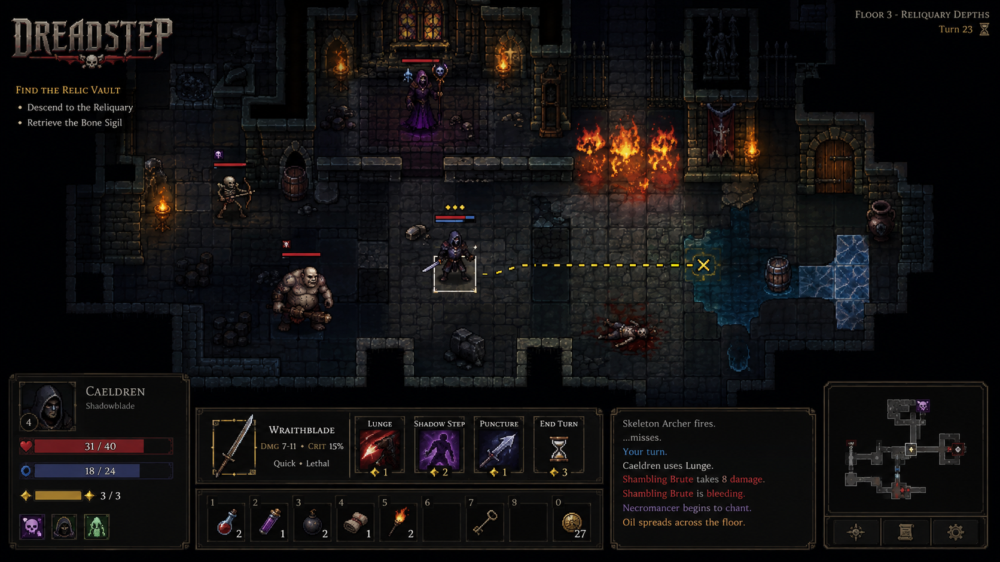

# Dreadstep



_Concept art only—not a screenshot of the current game. It illustrates an aspirational direction and is subject to change._

> Every step is a decision.

Dreadstep is a fast, gothic tactical roguelike about deliberate movement, dangerous dungeon
descent, distinctive loot, and a compact vocabulary of systems that combine in surprising
but understandable ways.

The game is also being built as a deterministic simulation first. Rust tests, headless
tools, MCP agents, and the future Bevy client will issue the same semantic commands and
observe the same events. The engineering exists to make the game better; players should
not need to care about the testing architecture to enjoy it.

## Current Status

Dreadstep is continuing Milestone 3: the human presentation boundary.

- Verified foundations
  - Deterministic core rules, replay evidence, the headless CLI, protocol/MCP observation and
    actions, tester operations, and stdio tools.
  - Opaque item ownership, catalog binding, authored starter placements, deterministic starter-item
    content, tester transfer/drop/pickup, and Bevy item-run startup; default `start_run` remains
    item-free.
  - Scheduled single-slot equipment and single-item consumption contracts with digest/replay/
    snapshot evidence, protocol/MCP projections, atomic tester/player guards, and typed Bevy scene
    and cue projections; effects, modifiers, capacity, and richer item semantics remain deferred.
- Verified headless Bevy boundary
  - Shared authored floors, runtime/app projection, deterministic keyboard dispatch, feedback,
    focus, scene focus, camera, viewport, tile/actor/ground/inventory mirrors, typed HUD status,
    ordered messages, audio cues, animation cues, and sprite-role metadata.
  - Caller-selected checked pixel placement, native 24×24/32×32 evidence with a provisional 32×32
    working size, and complete ordered render/sprite-key/command/node projections.
  - Local-only pixel-art and audio manifests preserve typed placeholder/cue metadata without file
    loading, asset handles, playback, or render plugins; media binaries remain ignored.
- Verified Sprite API boundary
  - `PresentationBevySpriteProjection` derives deterministic solid-color `Sprite` values with
    optional 32×32 sizing from stable placeholder nodes while preserving inventory-unplaced and
    authority-guard semantics; no Sprite/render plugin or production image is loaded.
- Verified ECS Sprite-node attachment
  - The current slice attaches those typed `Sprite` values to retained render-node ECS entities,
    preserving node identity and default required components without enabling a render plugin,
    transform placement, texture loading, or production media.
- Verified typed Sprite-transform projection
  - The headless boundary derives ordered map-space translations from checked pixel origins while
    keeping inventory unplaced and ECS transforms unchanged; fresh missing tile size starts
    unplaced while later removal preserves checked translations. Camera, visibility, window,
    renderer, and production media remain deferred.
- Verified ECS Sprite-transform attachment
  - The presentation boundary attaches checked `(pixel_x, pixel_y, 0)` logical-pixel translations
    to retained map-node `Transform` components while keeping inventory unplaced; centering, anchors,
    depth, cameras, visibility, rendering, and production media remain deferred.
- Verified deterministic ECS Sprite depth
  - The presentation boundary derives terrain/ground/actor z-layer values from the existing typed
    render layer while preserving checked x/y placement and inventory default state; centering,
    anchors, cameras, visibility, rendering, and production media remain deferred.
- Still deferred
  - Windowing, Sprite/render plugins, production textures/assets, centering/anchor policy and
    cameras, animation playback, HUD widgets, event/combat message presentation, audio assets/
    playback, fog of war, multiple floors, and richer gameplay item semantics such as effects,
    modifiers, capacity, and additional slots.

The long-term design and roadmap are in
[`docs/dreadstep-proposal.md`](docs/dreadstep-proposal.md). Verified current and planned
work lives in [`SPEC.md`](SPEC.md).

## Local Presentation Assets

Pixel-art and audio binaries are intentionally excluded from GitHub. Keep local copies under
the root or crate-local `assets/`, `art/`, or `audio/` directories; the repository ignore rules
keep everything in those media directories available in a working tree without allowing accidental
commits. Store or sync the files manually through the project’s external asset service. Keep
source, creator, license, attribution, and modification records outside those directories in
tracked documentation such as
[`CREDITS.md`](CREDITS.md) and the proposal; do not commit service credentials.
The tracked concept-art reference and future README screenshots under root `screenshots/` are
explicit exceptions because they are outside the local-media directories.

## Design Principles

- Every movement choice should matter without making routine turns laborious.
- Prefer a small number of strongly differentiated items, enemies, and interactions.
- Compose explicit rules instead of accumulating special cases.
- Make outcomes legible so players can learn from surprise rather than confusion.
- Keep the simulation authoritative and presentation replaceable.
- Use agents for deterministic exploration and regression discovery, not as a substitute
  for human judgment about clarity, pacing, atmosphere, and fun.

## Architecture

```text
protocol ----> core <---- content
                  ^
                  |
       +----------+----------+
       |          |          |
    headless     MCP       Bevy
```

`dreadstep-core` owns semantic game truth. The other packages translate content or external
effects around that kernel. See [`ARCHITECTURE.md`](ARCHITECTURE.md) for ownership,
dependency direction, and invariants.

## Getting Started

Install [Rustup](https://rustup.rs/), then clone the repository. The committed toolchain
file installs the pinned Rust compiler, Rustfmt, and Clippy.

On Apple Silicon macOS, first install Xcode command-line tools:

```sh
xcode-select --install
```

On Linux and WSL2, Milestone 0 verification is headless and does not require Wayland, X11,
or audio development packages. Windows contributors should use the MSVC Rust toolchain and
Windows build tools.

Run the complete local verification suite:

```sh
scripts/verify.sh
```

Run the developer scenario directly after building the headless package:

```sh
cargo run -p dreadstep-headless -- --seed 7 --commands 'move:1:east,wait:2'
```

The first build downloads and checks Bevy's minimal dependency set and can take longer than
later runs.

## Repository Guide

- `crates/`: domain, content, protocol, and adapter packages.
- `SPEC.md`: completed, active, and planned capabilities with verification criteria.
- `ARCHITECTURE.md`: current package ownership, data flow, and constraints.
- `LESSONS.md`: verified recurring traps and their prevention.
- `CONTRIBUTING.md`: setup, spec-first TDD, style, review, and handoff guidance.
- `.agents/skills/`: reusable Dreadstep development and review workflows.

Terms used in the project:

- **Functional core:** deterministic domain transformations separated from external effects.
- **Adapter:** code that translates external input or output around the domain kernel.
- **MCP:** Model Context Protocol, planned here as a bounded interface for player and tester
  agents.
- **Semantic event:** a game-meaningful outcome such as movement or damage, independent of
  animation or transport formatting.

## Contributing

Contributors from different technical and creative backgrounds are welcome. Begin with
[`CONTRIBUTING.md`](CONTRIBUTING.md), which explains the development workflow without
assuming prior knowledge of Rust, Bevy, roguelikes, or agent tooling.

## License

Dreadstep source code is available under the [MIT License](LICENSE).
